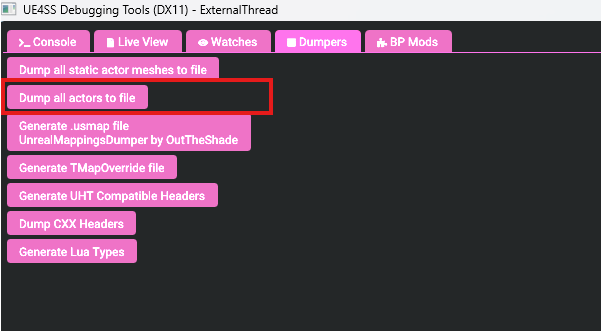
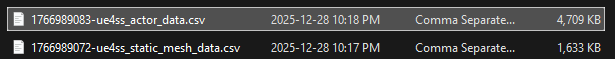
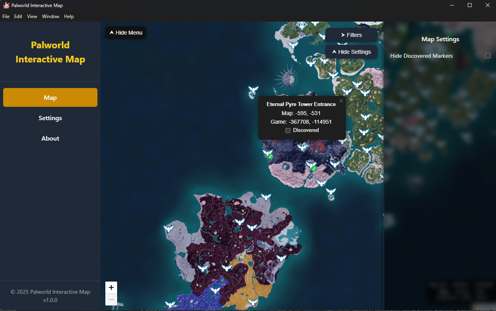
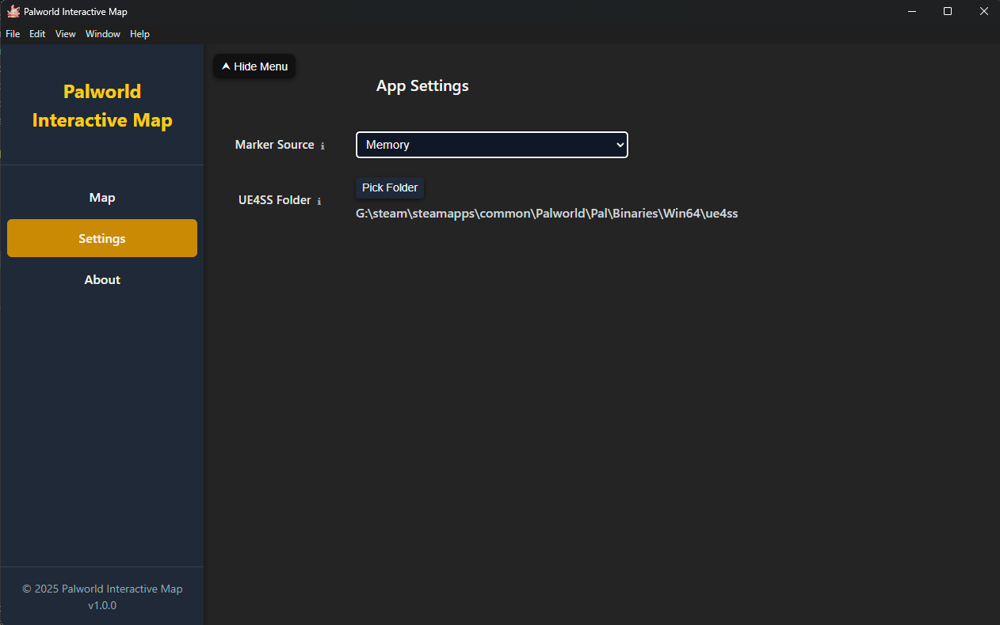
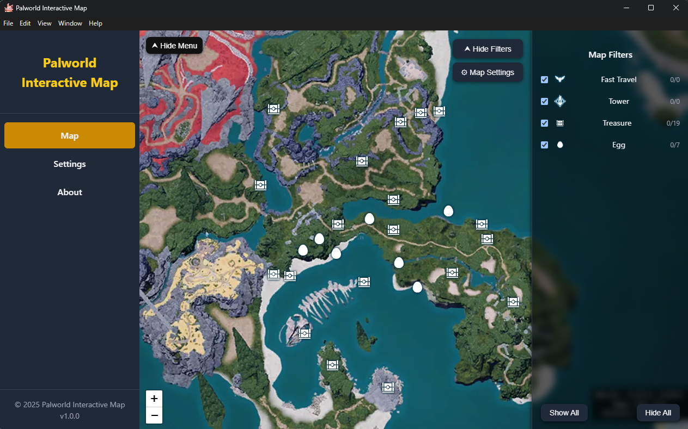

# 🗺️ Palworld Interactive Map

An interactive **Palworld world map** with marker progress tracking and **Windows desktop support via Electron**.

Users can:

- Explore the Palworld map
- View and filter map markers from
    - In game data mining
    - Realtime game treasure/pal egg data from game memory
- Mark discovered locations
- Track marker progress
- Run the app in:
    - Browser (web): `http://localhost:8013/`
    - Desktop app (Electron, Windows)
    - Mobile device via LAN: `http://{your_desktop_private_ip}:8013/`  
      _(when the desktop app is running)_

---

## 🧩 Project Architecture

This project is organized as a **monorepo-style setup** with two main parts:

### Data Mining

```text
pal-data-mining/
├── src/        # Scripts to data-mine Palworld Unreal Engine files
└── output/     # Extracted Palworld marker data (JSON)
```

### Application

```text
pal-map/
├── frontend/   # Vue 3 app (UI + interactive map)
├── backend/    # Node.js + Express API (SQLite persistence)
├── electron/   # Electron wrapper (desktop app)
└── data/       # SQLite database (dev / local only)
```

> 📦 **Electron persistent data location (Windows):**  
> `C:\Users\{username}\AppData\Roaming\palmap-desktop\`

---

## 🚀 Features

- 🗺️ Interactive Palworld world map
- 📍 Custom markers with discovery status
- ✅ Visual indicators for discovered locations
- 🔍 Marker filters by:
    - Marker type
    - Discovery status
- 💾 Persistent progress storage using SQLite
- 🖥️ Works in both browser and Electron desktop app
- 📱 Mobile-friendly via LAN access while desktop app is running
- 🧠 Safe migration path for future versions

> 💡 Personal use case:  
> I often keep the map open on a mobile device while gaming on my desktop to manage progress without alt-tabbing.

---

## 🛠️ Tech Stack

### Frontend

- Vue 3
- TypeScript
- Leaflet

### Backend

- Node.js **20.x**
- Express
- better-sqlite3

### Desktop

- Electron

---

## 🛠️ Development

### The Map asset data mining script

Please refer to `pal-data-mining/README.md`

### Local / Web Development

1. Start the backend:

    ```bash
    cd pal-map/backend
    npm run dev
    ```

2. Start the frontend:

    ```bash
    cd pal-map/frontend
    npm run dev
    ```

3. Open the app:
    ```text
    http://localhost:5173/
    ```

---

### Electron Desktop App (Windows)

1. Build the backend:

    ```bash
    cd pal-map/backend
    npm run build
    ```

2. Build the frontend:

    ```basha
    cd pal-map/frontend
    npm run build
    ```

3. Build the Electron app:

    ```bash
    cd pal-map/electron
    npm run build
    ```

4. Output location:
    ```text
    pal-map/dist/win-unpacked/
    ```

---

## Load Markers from Memory

In **Palworld**, some collectibles are permanent, such as unlocking fast travel points or defeating bounty/alpha Pals. Other collectibles can respawn over time, like treasure chests and Pal eggs.

To make it easier to track these respawning items, this feature reads all active treasure chests and Pal eggs from the game memory and displays them directly on the map.

### Instructions

1. **Download UE4SS** from [UE4SS GitHub](https://github.com/UE4SS-RE/RE-UE4SS).  
   I used the **zDev version** from [here](https://github.com/UE4SS-RE/RE-UE4SS/releases/tag/v3.0.1).

2. **Install UE4SS** following their tutorial.  
   Example path:  
   `G:\steam\steamapps\common\Palworld\Pal\Binaries\Win64\ue4ss`

3. **Open the game** and load your save. Then open the **UE4SS tool**.

4. **Dump actors to a CSV file** via the UE4SS menu:  
   `Dumpers -> Dump all actors to file`
   
5. After dumping, you should see a file like:  
   `xxxxxxxx-ue4ss_actor_data.csv`  
   located in:  
   `G:\steam\steamapps\common\Palworld\Pal\Binaries\Win64\ue4ss`
   
6. **Open Palworld Interactive Map**, go to **Settings**, switch the **Marker Source** from `Game` to `Memory`, and select the UE4SS folder you just used:  
   `G:\steam\steamapps\common\Palworld\Pal\Binaries\Win64\ue4ss`

7. **Switch to the map view**. You should now see in-game markers loaded on the map.

### Limitations

- Memory data is **not updated in real-time**.
- Users must manually dump actors via the UE4SS tool and refresh the Palworld Interactive Map to update markers.
- Future improvements may automate this process to reduce manual steps.

## Screenshots

Here are some screenshots of Palworld Interactive Map to give you a better idea of the UI and features.

### Map View



### App Settings



### Memory Markers

  
_Markers loaded from game memory using UE4SS._

## 🙌 Credits

- **Palworld** © Pocketpair
- **FModel** – Unreal Engine asset unpacking tool
  https://github.com/4sval/FModel
- **UE4SS** –Unreal Engine 4/5 Scripting System
  https://github.com/UE4SS-RE/RE-UE4SS
